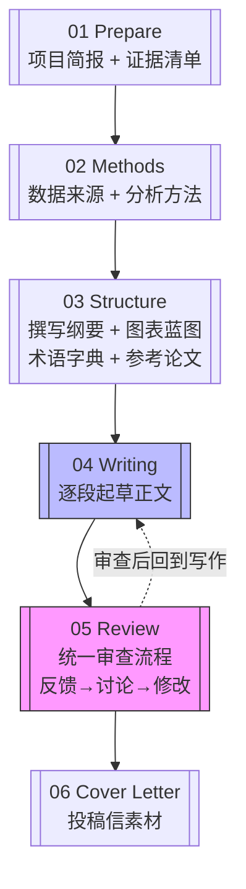

# Ocean Paper Writer

面向海洋科学研究者的论文写作辅助工具：将项目书、图表、代码和文献等零散材料，分阶段整理为结构化的手稿与投稿素材。

**核心思路：** 论文写作的起点很分散 — 项目书、论文图、分析代码、数据描述、文献笔记、导师反馈。
把这些碎片拼成一篇连贯的论文，很难一步完成。
这个工具把主体论文构建拆成五个核心阶段，并把 polish 作为 review-writing 循环中的子工作流；投稿前可进入可选的 06 Cover Letter 阶段准备投稿说明材料。每个阶段产出可供你审阅、修改、反复打磨的中间文件。
你控制研究内容、科学判断和最终文字；工具辅助整理材料、起草初稿、检查一致性。
决定权始终在你手上。

## 安装

```bash
git clone https://github.com/441837297/ocean-paper-writer.git ~/.claude/skills/ocean-paper-writer/
```

重启 Claude Code 即可。详见 [INSTALL.md](INSTALL.md)。

升级：

```bash
cd ~/.claude/skills/ocean-paper-writer && git pull
```

## 环境配置

**Zotero 文献支持配置（可选）：**

Zotero MCP（`cookjohn/zotero-mcp`）是一个可选增强。
如果你希望从自己的 Zotero 文献库检索真实文献，需要提前安装并配置。
prepare / methods / structure 阶段不依赖 Zotero；writing / review / polish 中涉及文献支撑时才会建议检索 Zotero。
建议提前把项目相关文献导入 Zotero 库，方便检索。
具体安装见 `references/zotero/README.md` 和 [cookjohn/zotero-mcp](https://github.com/cookjohn/zotero-mcp) 上游文档。

## 工作流程

主体论文构建分五个核心阶段，另有 polish 子工作流；投稿前可进入可选的 06 Cover Letter 阶段。每次只推进一个阶段：

1. **准备（Prepare）** — 你提供项目书、图表和研究想法。
   工具会问 3-5 个关键问题，然后生成项目简报和证据清单。
   这是后续所有内容的基础。

2. **方法（Methods）** — 工具读取你的代码和数据描述，分两块记录：数据来源与预处理（`02a_data.md`），以及分析流程与统计方法（`02b_methods.md`）。
   你逐项确认或修正。

3. **结构（Structure）** — 产出三个互不重复的文件，作为写作阶段的精准材料源：
   - `03_section-architecture.md`（论文撰写纲要）：section role、P-ID range、主张层级、论证链。
   - `03_figure-outline.md`（图片蓝图）：每张图的科学问题、panel 内容、caption 骨架。
   - `03_terminology.md`（术语字典）：唯一术语权威来源，全文一致性检查。

4. **写作（Writing）** — 逐段推进。工具起草，你审阅。每段之后你说：保留 / 修改 / 扩展 / 继续。
   默认顺序：Methods → Results → Introduction → Discussion → Conclusion → Abstract。
   产出 `04_manuscript-draft.md`（初稿）。
   **精准加载：** 写作时只加载目标节的期刊规则（`Shared + 当前节`）+ 术语表全文 + House Rules，不使用整个期刊 profile。
   包含图表标题（caption）生成，遵循三部分结构：主题 → 关键内容 → 数据来源。
   需要文献支撑时，工具会先征求你的同意再检索 Zotero。

5. **审查（Review）** — GPT 决策，ClaudeCode 执行：
   ClaudeCode 编译原始反馈为 `05_review-round{N}A_source.md` → 用户发给 GPT → GPT 输出 `05_review-round{N}B_report.md`（Issue Log + Revision Contract + Patch List）→ ClaudeCode 按 B_report 执行修改。
   每轮审查后修改稿保存为 `04_manuscript-reviewN.md`（N 全局递增）。
   **修改前先检查 Backpropagation Gate：若涉及结构变更，先更新 03 文件，用户确认蓝图后再动正文。**
   可选加载导师审稿视角检查清单（`references/review/tutor-review-checklist.md`），按稿件 section 和通用原则核查导师重点关注的论证问题。

   **润色（Polish，子工作流）** — 逐段精修已确认的文本，优化清晰度、流畅度和期刊语气。
   润色修改保存为 `04_manuscript-reviewN-polishM.md`（M 为 polish 子编号，随新 review 重置）。
   **没有独立的润色日志文件** — 所有修改记录写入 `04_writing-log.md` 的 Revision Notes，与审查修改共享同一记录格式。
   可选：投稿前运行 style naturalization audit，先扫描 AI-like phrasing 再逐项改写。

6. **投稿说明材料（Cover Letter，可选）** — 在手稿核心声明和目标期刊基本确认后，整理给编辑的 cover letter。
   采用七段结构：投稿声明 → 一句话稿件概要 → 期刊适配（对标该刊已发文献）→ 知识缺口 → 核心结果与意义 → 合规声明 → 礼貌结尾。
   不新增科学结论；未确认目标期刊时不生成。

任何阶段都可以暂停，稍后继续。
也可以回到前面的阶段 — 审查可以回到写作或结构，润色可以回到写作。
这不是单向流水线。

### 流程图



> 主流程从左到右推进，06 Cover Letter 为可选阶段。虚线回路：Review 完成后回到 Writing 修改正文。
> Polish 润色是 Review-Writing 循环的子工作流，不单独编号；润色修改直接写入 `04_writing/` 版本文件，
> 记录写入 `04_writing-log.md`。

## 不做什么

- **不会一次性生成全文。** 论文是逐阶段、逐段构建的。
- **不会替用户决定目标期刊。** 用户始终掌控。工具只记录用户的选择，或被明确要求时才给出建议。
- **不编造数据、方法、引用或导师意见。** 缺失信息用明确的标记注明。
- **不把弱证据写成强结论。** 证据边界在每个阶段都被保留。
- **不替代科学判断。** 工具整理和精炼；研究者决定什么是对的。
- **不保留特定期刊 profile。** 期刊风格通过对标典型参考文献实现。

## 适合谁

海洋科学研究者，尤其是使用卫星数据、Argo 浮标、再分析产品或海洋模式输出、从代码和图表开始准备期刊论文的研究生、博士后和科研人员。

## 协作模式

这个工具生成的 md 文件是你和 AI 的协作文件。

- 工具为每个阶段生成初稿。
- 你审阅后，可以**直接修改任何内容** — 数据描述、声明措辞、方法细节、图表解读。
- 在下一个阶段（或恢复工作时），工具**读取你修改过的文件**，保留你已确认的内容，只补充标记为 `[MISSING]`、`[TODO]` 或 `[CITATION NEEDED]` 的部分。
- 你的修改不会被覆盖。你的专业知识优先于工具的推测。

## 项目文件

开始一个项目后，工具会在你的项目目录下生成以下结构。每个文件有单一明确的用途（只有多文件阶段才加 `a`/`b` 后缀）：

```
project-root/
├── CLAUDE.md
├── 01_prepare/
│   ├── 01a_project-brief.md         # 研究问题、背景、数据概览（prepare 阶段快照）
│   └── 01b_evidence-inventory.md    # 图→声明对应表、证据强度、故事路线
├── 02_methods/
│   ├── 02a_data.md                  # 数据来源、预处理、版本信息
│   └── 02b_methods.md               # 分析流程、变量定义、统计方法
├── 03_structure/
│   ├── 03_section-architecture.md    # 论文撰写纲要：section role、P-ID range、主张层级、论证链
│   ├── 03_figure-outline.md         # 活文档：图表顺序、科学问题、caption 骨架、图-声明映射
│   ├── 03_terminology.md            # 术语字典：标准术语/禁止变体对照表，全文一致性检查
│   └── old/                         # 旧版项目书与图表蓝图的归档
├── reference_papers/                # 参考论文全文（建议预先转为 MD），用于风格参照与术语对齐
├── 04_writing/
│   ├── 04_manuscript-draft.md       # 初稿（04 阶段直接产出）
│   ├── 04_manuscript-reviewN.md     # 第 N 轮审查后修改稿（N 全局递增）
│   ├── 04_manuscript-reviewN-polishM.md  # Review N 的第 M 轮润色修改稿
│   └── 04_writing-log.md            # 统一日志：起草单元状态、文献速查、修订记录（含审查+润色）
├── 05_review/
│   ├── 05_review-round{N}A_source.md  # 第 N 轮：ClaudeCode 编译原始意见
│   └── 05_review-round{N}B_report.md  # 第 N 轮：GPT 分析报告（Issue Log + Revision Contract + Patch List）
└── 06_cover-letter/
    └── 06_cover-letter.md           # 投稿信，贡献声明对齐期刊 scope
```

> 注意：Polish 润色不单独编号，无独立目录。润色输出是 `04_writing/` 中的手稿版本，修改记录写入 `04_writing-log.md`。

这些文件存放在你的论文项目目录中，不在 Skill 代码仓库内。
随着推进逐步积累，随时可以打开、阅读、直接编辑。
如果你已有之前生成的项目文件，打开项目目录，告诉工具你上次做到哪了。
工具也会自动检测已有文件，判断当前应该从哪个阶段继续。

## 开始使用

如果你从零开始 — 手头有项目书、图表、代码或研究想法 — 从 **prepare** 阶段开始。
告诉工具你的项目书、研究描述、图表、代码（如有）、目标期刊（如已确定），以及导师的要求或限制。

工具会先问 **3-5 个关键问题** 澄清缺失信息，然后生成项目简报和证据清单。
在此阶段不会跳入正文起草。

## 目标期刊处理

**你决定目标期刊，工具不替你选择。**

- 如果确认了目标期刊：工具会记录在项目文件中，后续写作、审查和润色阶段通过**对标典型参考文献**来落实期刊风格（句式、结构、论证深度）。
- 如果暂时没有确认：按标准流程推进，写作和润色阶段时再落实期刊规范。

写作风格由 House Rules 和 `reference_papers/` 中的范文片段指导。不保留特定期刊 profile——具体期刊风格通过对标目标期刊的 2-4 篇近期典型论文实现。

Cover letter 阶段需基于已确认的目标期刊和参考论文生成，不会在未确认期刊时生成投稿信。

## 地学领域期刊参考

以下为地学领域常见投稿目标，写作时通过对标该刊近期论文实现风格匹配：

| 期刊 | 典型特征 |
|---------|-------------------|
| **GRL**（Geophysical Research Letters） | 单一锐利结论、精炼、简短讨论 |
| **JGR-Oceans** | 完整证据链、方法透明、论证严谨 |
| **JPO**（Journal of Physical Oceanography） | 动力学优先、机制驱动、物理精确 |
| **Nature Communications** | 广泛意义、跨学科可读、证据有边界 |
| **Nature Climate Change** | 气候变化中心、地球系统关联、后果导向 |
| **Science** | 广泛科学意义、突破性发现、极精炼 |

> 以上为领域参考，非内置 profile。实际写作风格以你提供的该刊近期参考论文为准。

## 写作与润色理念

写作和润色都遵循**微单元原则** — 小块可确认的文字，而非大段一次性生成。

### 写作

- **默认单元：** 一段。
- **最大单元：** 一个小节。
- 每段起草后你确认了，再推进到下一段。
- 默认起草顺序：Methods → Results → Introduction → Discussion → Conclusion → Abstract。

### 润色

- 推荐逐段精修已确认的文本。
- 也可在投稿前运行 style naturalization audit：检测 AI-like phrasing、泛化学术填充、夸大声明语言，先出报告后由用户选择修改范围。
- 润色不制造新证据，不掩盖证据缺口。如果某条声明缺乏支撑，工具会标记并把你送回检查点。

## Zotero 文献支持

**安装：** Zotero MCP（`cookjohn/zotero-mcp`）必须在开始写作前安装并测试通过。
参考 `references/zotero/README.md` 获取完整安装说明和上游文档链接。
安装后，建议将项目相关文献提前导入 Zotero 库中，方便后续检索调用。

**角色：** Zotero 在这个工具中是文献支撑层。
它不替代你的证据、数据或科学判断。
工具默认以**只读模式**运行，不会在你的 Zotero 库中创建、编辑或删除任何内容。

**何时介入：**
- **写作 Introduction、Discussion 或 Results 时**：工具识别需要文献支撑的声明，征求你的同意后检索 Zotero 文献库，将每条声明锚定到真实文献上。
- **方法阶段**：查找数据产品或方法的标准引用。
- **审查阶段**：检查声明是否有足够的引用覆盖。

**每次检索 Zotero 文献库之前**，工具会说明原因、要读取什么、确认只读，然后等待你明确确认。
缺失的引用标记为 `[CITATION NEEDED]` — 工具从不编造参考文献。

## 代码仓库结构

```
SKILL.md                     # AI 执行规则
README.md                    # 本文件 — 用户使用说明
references/
  workflow/                  # 分阶段的流程规则
  templates/                 # 各阶段输出文件的格式模板
  journals/                  # 期刊 profile（含 _distill.md 按需蒸馏规则）
  writing/                   # 各章节写作指南
  review/                    # 审查参考：风格自然化 + 导师审稿视角检查清单
  zotero/                    # Zotero MCP 集成说明与配置记录
examples/                    # 分阶段使用示例
docs/                        # 开发记录
```

## 维护说明

此仓库面向维护者。扩展时请注意：
- 流程文件聚焦单一阶段；较大篇幅放在模板文件中。
- 期刊写作惯例通过项目 `reference_papers/` 中的近期论文提取，不新增内置期刊 profile。
- 保留逐阶段推进和逐段起草/润色的设计。
- 证据边界不可跨越 — 每个阶段的声明必须可追溯到证据。

## 致谢

本项目的工作流设计（分阶段推进、逐段起草与润色、style naturalization 审计）受到
[Paper-Polish-Workflow-skill](https://github.com/Lylll9436/Paper-Polish-Workflow-skill)
的启发。感谢作者的开源贡献和思路分享。
