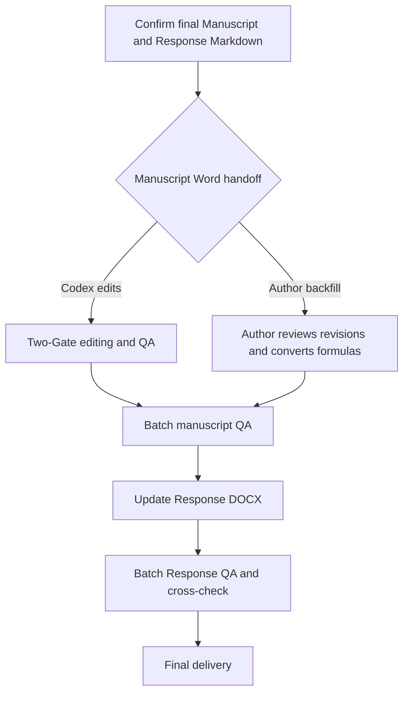

# DOCX Tracked Revision Handoff

## Final Word Delivery Workflow

Begin after the final manuscript Markdown and final Response Markdown are confirmed. Choose the
manuscript Word handoff that matches the author's preferred working arrangement.

### Codex-Led DOCX Modification

Use the Per-Unit Two-Gate Workflow below when Codex applies confirmed revisions to the manuscript
DOCX. This branch uses the existing Word COM, Track Changes, field, formula-conversion, and
screenshot-verification rules.

### Author Incremental Editing

Use this branch when the author applies confirmed final content in the manuscript Word. The author
renders formulas manually and provides one current-page screenshot at a time.

For the current page, Codex reads the corresponding final manuscript Markdown and final Response
Markdown, then checks that the Word page implements confirmed wording, numbers, formulas, symbols,
figure and table numbering, revision marks, and layout.

- When the page is correct, reply exactly: `本页完成`, then continue with the next page.
- When revision is needed, list the omission location, current issue, and correct content. Review
  that page again after it is updated.

After all manuscript Word pages are complete, begin the Response Word final-delivery workflow in
`references/review/response-letter.md`.

## P5. Batch Manuscript Final QA

Begin after P4: the author has reviewed the tracked revisions and completed formula conversion.
Treat the frozen manuscript Markdown as the content authority.

1. Call `scripts/export_word_pdf_pages.ps1` twice in new temporary directories: once with `-View Final` and once with `-View Markup`. The script exports with Word and renders every PDF page to a 600 DPI PNG.
2. Compare every Final page with the corresponding manuscript Markdown for visible text, numbers, units, formulas, symbols, figures, tables, captions, numbering, and layout.
3. Inspect every Markup page for revision placement, line breaks, formula alignment, page breaks, and table overflow.
4. Review an affected page in Word only when the PDF cannot show a MathType object, field, comment, or revision state clearly.
5. Correct a Word transfer error in P3. Update Markdown and matching Response text in P2 before changing confirmed content. Repeat P5 after correction.

Complete P5 when every page has passed and the manuscript Word file's final visible content matches the frozen Markdown.

Keep the submitted source DOCX immutable. Create one field-cleaned baseline and one cumulative tracked
DOCX from it. Enable Word Track Changes only in the cumulative tracked DOCX after the common
initial cleanup. Continue every confirmed edit in that file. Do not create clean, compared, hash,
or audit outputs.

## Per-Unit Two-Gate Workflow

### Gate 1: Preview and confirmation

For every Word unit, present the preview in exactly this order. Do not present the complete revised
unit as a replacement.

### 1-2. Diff and reasons

List changes one by one. Keep every diff and its explanation together:

1. Use a fenced `diff` block with one deleted line (`-`) and one added line (`+`) so the interface
   renders the original in red and the revision in green. Keep only the shortest context needed to
   locate the change; split unrelated changes into separate blocks.
2. Immediately after each diff block, explain the scientific, numerical, terminological, or
   rhetorical reason in Chinese. Identify the relevant response comment and, when applicable, the
   confirmed calculation, working manuscript, terminology decision, or other authoritative project
   source.

Do not collect all diffs first and explanations later. Do not rely on HTML font colors.

### 3. Chinese translation

Provide a complete Chinese translation of the revised Word unit as one independent paragraph. Do
not mix diff notation or revision explanations into the translation.

### 4. Overall analysis and decision

Analyze the revised unit as a whole. State:

- whether its scientific meaning or evidence strength changes;
- whether it fully matches the relevant response;
- whether terminology, logic, numbers, citations, equations, or Word fields require attention;
- what decision, if any, the author needs to make before backfilling.

End with a concrete decision level suited to the actual risk. Do not force every case into the
binary labels `要我判断` and `无需判断`. Use a precise conclusion such as:

- `无需你判断，可以按已确认文本回填。`
- `建议你关注，但不影响本段回填。`
- `需要你确认措辞后再回填。`
- `需要你判断科学含义后再回填。`
- `当前不能安全回填，需先解决上述问题。`

The decision level describes the author's required scientific or editorial judgment. It does not
replace the required user confirmation before writing to the DOCX.

Stop after item 4 and wait for user confirmation.

### Gate 2: Word and screenshot

After confirmation, edit and verify the unit, then close the writing session. Open the DOCX for the
user to capture an **All Markup** screenshot and stop. After the user sends the screenshot, review it
and close Word. Advance only after the unit passes visual inspection.

Editing rules:

- With Track Changes off, delete the Zotero bibliography field from both the field-cleaned baseline
  and cumulative tracked DOCX. Preserve the `REFERENCES` heading and all in-text citation fields.
  Do not modify the submitted source DOCX. Enable Track Changes in the cumulative tracked DOCX only
  after this cleanup.
- Use Word COM and replace each smallest uniquely located range separately. Never replace a whole
  paragraph when the confirmed diff changes only phrases or sentences; preserve all unchanged text,
  existing OMath, fields, and formatting so Track Changes marks only the actual edits. Do not rebuild
  a scientific DOCX with `python-docx`.
- Treat tracked DOCX editing as a low-freedom operation:
  - Never reuse absolute character offsets after a tracked edit. Hidden insertion and deletion nodes
    change subsequent Word ranges.
  - Never search repeatedly for the same old token after replacing it; Word may match the deleted
    revision text again. Locate repeated tokens with unique surrounding text, or edit one occurrence,
    save, reopen, and verify before continuing.
  - Never fall back to whole-paragraph replacement when Find fails or the search text exceeds Word's
    limit. Narrow the search to a unique phrase or split the confirmed change into smaller ranges.
  - Save a checkpoint between risky units so a later failure cannot invalidate an already verified
    batch.
  - If a paragraph is accidentally replaced wholesale, reject only that paragraph's new revisions,
    then reapply the confirmed phrase- or sentence-level edits.
- After every write, verify the accepted/final OOXML text, check for duplicated or corrupted tokens,
  confirm the expected insertion and deletion nodes, and confirm that substantial unchanged text
  remains whenever the intended edit is surgical. If All Markup shows an entire paragraph as revised
  when only local changes were confirmed, reject that paragraph's revisions and redo it before
  proceeding.
- Preserve styles, tables, captions, fields, headers, footers, and section layout.
- If a Word unit is unchanged, report it briefly and advance without a write or screenshot gate.
- Check fields and OMath before writing. Never replace or insert citations or citation placeholders;
  report the required manual change in the conversation.
- If a revision requires inserting or moving a Zotero citation, edit only field-free text and ask
  the user to complete the Zotero action in Word. Verify the saved result before advancing.
- If the user refines wording during DOCX review, update the working manuscript first, then update
  any matching Response revised text before editing Word.
- Run the final formula pass in two separately confirmed phases:
  1. **Read-only inventory:** Scan body text, captions, tables, appendices, and text boxes. Classify
     each item as correct native OMath, unconverted linear notation, MathType or another embedded
     equation object, or a legacy image, empty object, or malformed formula. Compare notation with
     the authoritative working manuscript, especially lowercase `e` versus volume-integrated `E`,
     subscripts, superscripts, vectors, Greek letters, and equation numbers. Report the inventory in
     the conversation only; do not create an audit file or modify Word. Wait for user confirmation.
  2. **Confirmed conversion:** Preserve correct existing equations and use the author-confirmed
     equation engine. Convert simple structured notation such as `E_K^1`, `Q_P`, `T_n`, and `F_K^1`
     to native Word OMath. Use MathType-compatible input for complex fractions, integrals, multiline
     equations, or formulas assigned to MathType. Keep simple combinations such as `0.5R` as ordinary
     text unless the author requests otherwise.
- Before converting a full formula class, test one representative item. Word COM may automate simple
  subscript/superscript OMath only after the test succeeds and structural verification confirms the
  expected OMath elements. Do not use COM for accents, overbars, integrals, multiline equations, or
  MathType-object replacement. If automation fails, restore the exact original token or object first,
  then provide the author with the required Word- or MathType-compatible input for manual replacement.
  Treat manual author replacement as the normal fallback, not as a reason to retry unsafe automation.
- Convert only uniquely located ranges, save between small batches, and never bulk-delete embedded
  equation objects. Preserve layout tables, their rows and columns, and equation-number cells. After
  conversion, verify formula counts, remaining linear tokens, subscripts, superscripts, vector
  formatting, baseline alignment, equation numbers, and table layout. Finish with dedicated All
  Markup screenshots of representative body text, captions, display equations, and appendix tables.
- In tables, preserve the existing table structure and replace only the visible cell content range,
  excluding the end-of-cell marker. Verify every affected cell's final text or value exactly.
- Keep simple inline numeric-letter combinations such as `0.5R` as ordinary text unless the author
  requests mathematical formatting; reserve OMath conversion for structured subscripts,
  superscripts, Greek symbols, operators, and equation expressions.
- Preserve the manuscript's dimensional notation: do not relabel a horizontal or vertical integral
  as a fully volume-integrated quantity unless the defining integration and terminology support it.
- Explain an asymmetry only on the side directly supported by the evidence. Do not invent a
  reciprocal mechanism for the contrasting side merely to make the explanation symmetrical.
- Verify once that Word opens the file, native revisions exist, and only the current unit changed.
- After programmatic verification, explicitly ask the user to send a screenshot of the current Word
  unit with **All Markup** visible. Review revision placement, red/green markup, line breaks,
  superscripts/subscripts, equations, and paragraph formatting. Do not advance to the next Word unit
  until the screenshot has been reviewed and any visual issue has been resolved.
- Keep all interpretation, diffs, manual items, and verification results in the conversation. Do not
  create audit records or run hash or document comparison checks.

## Word COM Lock and Timeout Recovery

Ask the user to close the target DOCX before writing. If Word COM times out:

1. Check whether the edit was saved before retrying.
2. After user confirmation, close only orphaned Word processes started by the operation.
3. Retry once with visible Word.
4. If it still fails, stop. Do not rewrite the DOCX with `python-docx` or raw OOXML.
